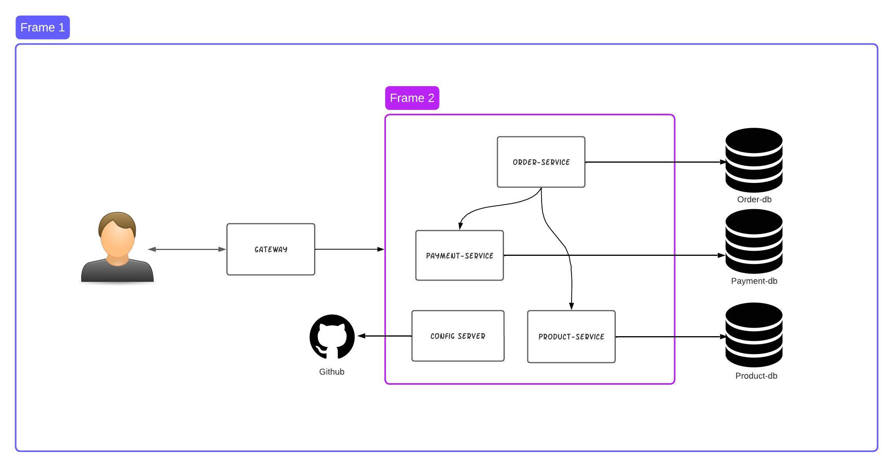

# E-commerce service using microservices
I've developed an e-commerce service server using the Java and Spring Boot framework, implementing a microservices architecture.

## Architecture for microservices

Features:
1. OpenFeign Client: Implemented communication between services using OpenFeign service.
2. Config Server: Deployed configurations for all the services on github and a config server that serves the configurations.
3. Gateway: Implemented a gateway service that takes all the requests and redirects them to respective services.
4. Service Registry: implemented Service registry using Netflix Eureka server
